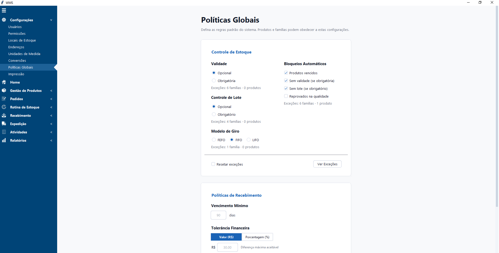
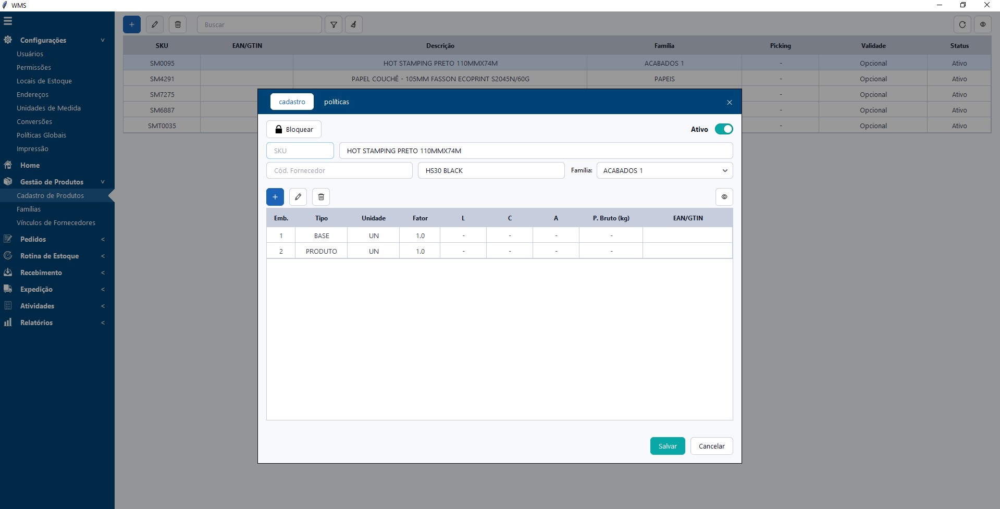
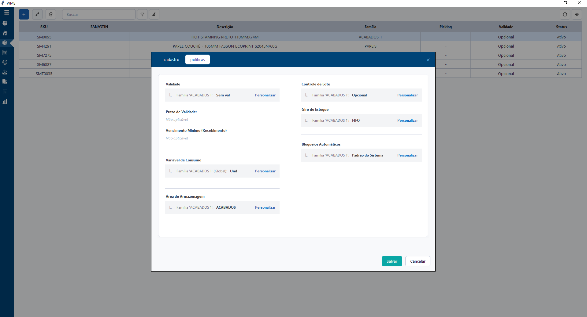
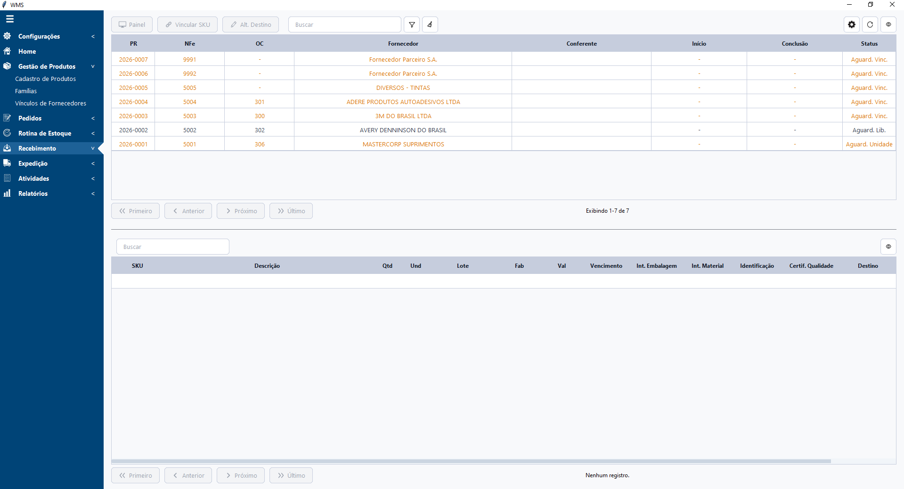

# WMS - SISTEMA DE GERENCIAMENTO DE ARMAZÉM

> 🚧 **Projeto em desenvolvimento** 🚧

Este é um projeto pessoal de um WMS (Warehouse Management System) projetado especificamente para atender à realidade das indústrias de conversão. O objetivo do sistema é controlar o armazenamento e a movimentação de produtos e matérias-primas — como jumbos de fitas dupla face, fitas adesivas e bobinas de papel —, cobrindo todo o fluxo, desde o recebimento, passando pela transformação até a expedição final.

## 🛠 Tecnologias Utilizadas

- **Linguagem:** Python
- **Interface Gráfica:** Tkinter
- **Banco de Dados:** SQL Server

## ✨ Funcionalidades e Status

- [x] **Módulo de Recebimento (Em finalização)**
  - Automação da leitura de arquivos XML de notas fiscais.
  - 3-Way Match (Pedido x Nota x Conferência)
- [ ] **Módulo de Armazenamento**
  - Controle de posições, movimentação interna e inventário.
- [ ] **Módulo de Produção**
  - Liberação e retorno de matéria-prima
- [ ] **Módulo de Expedição**
  - Separação e endereçamento de pedidos

## 📸 Prints de Tela

